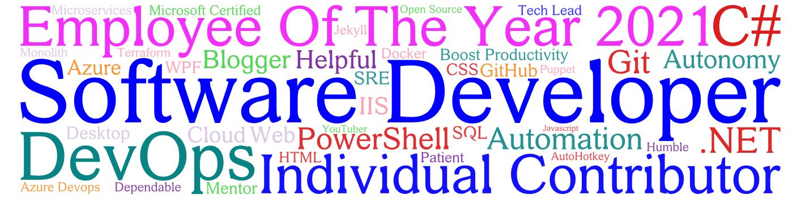

#  Hi, I'm Dan Schroeder, known on the web as deadlydog

## ℹ About me

- Have a passion for software development and automation.
- Been writing code for over 20 years; since ~2000.
- Master's degree in Computer Science.
- Enjoy creating open source software, mostly in GitHub.
- Also have some private repos and pipelines tucked away in Azure DevOps.

## 🍨 Content

- [My blog about programming and productivity tools](https://blog.danskingdom.com).
- [My YouTube videos](https://www.youtube.com/user/deadlydog/featured).
- [My open source repositories](https://github.com/deadlydog?tab=repositories&type=source).
- [My NuGet packages](https://www.nuget.org/profiles/deadlydog).
- [My PowerShell modules](https://www.powershellgallery.com/profiles/deadlydog).
- Created [DPSF (Dynamic Particle System Framework)](http://xnaparticles.com/ProjectsThatUseDPSF.php).

## 💬 Social

## 🏆 Stats

## 📜 Certifications

[My badges from Credly](https://www.credly.com/users/daniel-schroeder/badges)

## 🎈Just for fun

Watch a 🐍 eat my GitHub contributions 🍏.

